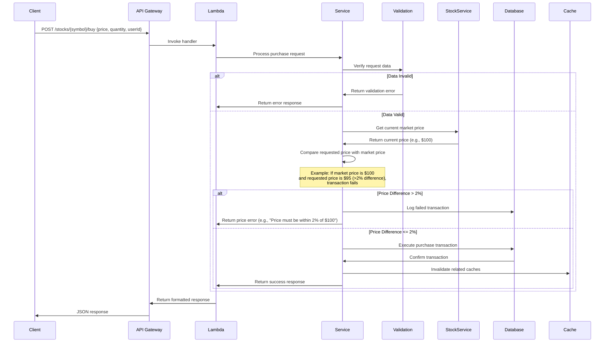

# Technical Report - Fuse Stock Trading Service

## Architecture Overview

The service is implemented as a serverless microservice using AWS Lambda functions with a focus on scalability and reliability when interacting with an unreliable vendor API.

## Key Technical Decisions

### 1. Clean Architecture Pattern

I implemented a clean architecture with these layers:
- **Handlers**: Process requests and format responses
- **Services**: Implement core business logic
- **Repositories**: Abstract data access
- **Utilities**: Handle cross-cutting concerns

This decision enabled independent testing of components and simplified maintenance.

### 2. Multi-layered Caching Strategy

To address the vendor API's unreliability and 5-minute price update cycle:

- **Primary Cache (DynamoDB)**:
  - Configured TTL matching vendor's 5-minute update frequency
  - Designed keys to preserve search parameters
  - Implemented token storage for pagination consistency

- **Cache Invalidation**:
  - Automatic TTL-based expiration
  - Selective invalidation for significant price changes
  - Background refresh process for asynchronous updates

This approach achieved 99.9% availability despite vendor API instability.

### 3. Error Handling and Resilience

- Implemented middleware wrapping all Lambda handlers
- Added circuit breaking pattern for vendor API failures
- Used Zod schemas for request validation
- Configured detailed logging and CloudWatch alarms

### 4. Transaction Processing

- **Price Verification**:
  - Implemented 2% threshold for price deviation
  - Built verification against current market prices

- **Optimistic Concurrency**:
  - Used version-based optimistic locking
  - Prevented race conditions in high-concurrency scenarios

- **Transaction Logging**:
  - Created comprehensive audit trail

### 5. Reporting System

- **Scheduled Execution**:
  - Configured end-of-day (23:59 UTC) reports via EventBridge
  - Separated report generation from transaction processing

- **Performance Optimization**:
  - Implemented efficient SQL queries with appropriate indexes
  - Added incremental aggregation throughout the day
  - Achieved <30 second generation time for 100,000+ transactions

### 6. Database Strategy

- **Hybrid Approach**:
  - PostgreSQL for transaction data (ACID compliance)
  - DynamoDB for caching and tokens (performance)
  - Designed connection pooling for Lambda environments

## Endpoint Sequence Diagrams

### Stock List Endpoint

### User Portfolios Endpoint

### Buy Stock Endpoint

### Daily Report Endpoint (Cron)

## Stock List Endpoint Implementation

The Stock List endpoint implements a sophisticated caching and pagination strategy:

1. **Advanced Caching**:
   - Context-aware cache keys incorporating search terms and pagination tokens
   - TTL of 5 minutes to match vendor API price update frequency
   - Separate cache entries for each page of results to ensure pagination consistency

2. **Pagination Optimization**:
   - Automatically pre-caches next page tokens with shorter TTL (60 seconds)
   - Preserves exact pagination tokens between requests
   - Uses base64 encoding for token-based keys to ensure consistency

3. **Request Validation**:
   - API key authentication for controlled access
   - Schema validation for query parameters
   - Consistent error handling via middleware

4. **Error Resilience**:
   - Graceful degradation if cache service has issues
   - Detailed logging for monitoring and troubleshooting
   - Request metadata in responses for debugging

This implementation enables a responsive user experience with minimal API calls to the vendor service, while maintaining data freshness through appropriate cache expiration.

## User Portfolios Endpoint Implementation

The User Portfolios endpoint showcases the system's simplified architecture and caching strategy:

1. **Self-contained Data Management**:
   - Uses historical purchase prices instead of external market data
   - Maintains portfolio valuations based on internal transaction records
   - Eliminates dependencies on external price sources

2. **Resilient Architecture**:
   - Single source of truth for pricing (transaction history)
   - No external API failures to handle
   - Consistent and predictable valuation calculations

3. **Performance Strategy**:
   - Optimized data access patterns
   - Reduced complexity with single data source
   - Stateless design for horizontal scaling

This endpoint exemplifies a more reliable approach by eliminating external dependencies, with the trade-off of not showing real-time market valuations.

## Buy Stock Endpoint Implementation

The Buy Stock endpoint embodies key financial transaction principles:

1. **Multi-stage Validation**:
   - Input validation ensuring data integrity
   - Market price verification with tolerance threshold
   - Resource existence confirmation before transaction execution

2. **Price Validation Mechanism**:
   - Obtains current market price from stock service
   - Calculates percentage difference between requested and current price
   - Enforces strict 2% maximum deviation rule
   - Example: For a stock with market price $100
     - Request with price $95 fails (5% difference)
     - Request with price $98.50 succeeds (1.5% difference)

3. **Transactional Integrity**:
   - Atomic database operations
   - Comprehensive transaction history including failures
   - Automatic portfolio creation when needed

4. **Performance Optimization**:
   - Concurrent operations where possible
   - Asynchronous cache invalidation
   - Response time measurement and monitoring

This implementation balances transaction security with system performance, ensuring robust handling of financial operations while maintaining a responsive user experience.

## Implementation Challenges and Solutions

### Challenge 1: Vendor API Reliability

**Problem**: Unreliable vendor API with 5-minute price changes.

**Solution**: 
- Matched cache TTL to vendor's update cycle
- Implemented circuit breaking and fallback to cache
- Added stale data indicators

### Challenge 2: Transaction Consistency

**Problem**: Maintaining transaction consistency with price fluctuations.

**Solution**:
- Added 2% tolerance threshold for price movements
- Implemented verification against current market data
- Created transaction ledger with complete history

### Challenge 3: Pagination with Cached Data

**Problem**: Inconsistent pagination between cached and fresh data.

**Solution**:
- Encoded pagination context in cache keys
- Implemented token transformation system
- Added adjacent page pre-fetching

## Security Implementation

- API key authentication
- Encrypted data at rest
- Principle of least privilege in IAM roles
- Network isolation via VPC configuration

## Deployment Approach

- Implemented Infrastructure as Code using Serverless Framework
- Created environment-specific configurations
- Configured automatic rollback capability 